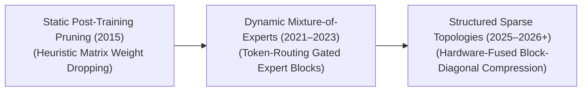

# Awesome-Sparse-Models

> **Awesome Sparse Models** is a curated list of research papers, guides, and engineering tools for sparse neural networks, Mixture-of-Experts (MoE), structured & unstructured pruning (like 2:4 sparsity), sparse attention kernels, and mechanistic interpretability. Optimized for high-performance AI scale, consumer-device edge deployment, and memory-bandwidth efficiency.

## 🧠 Sparse Models in AI: History, Progression, Variants, & Applications

A Sparse Model is an architectural paradigm in artificial intelligence designed to optimize computational efficiency, parameter storage, and memory bandwidth by enforcing sparsity across a network’s weights, activations, or routing pathways. In contrast to dense neural networks—where every parameter must be loaded and computed for every single data point—sparse models isolate and activate only a highly relevant subset of the parameter landscape per execution step. This approach transforms dense matrix operations into sparse tensor allocations, allowing specialized hardware compilers to bypass unnecessary zero-value floating-point operations (FLOPs). In the modern era of foundational AI, sparse modeling serves as a critical scaling engine, enabling networks to hold trillions of total parameters on disk while maintaining the inference speed and operational cost of a much smaller model.

---

## 📈 1. The Macro Chronological Evolution

The implementation of architectural sparsity has transitioned from static post-training weight elimination to automated layer pruning, moving toward modern data-dependent runtime gating matrices and structured sparse transformers.

| Era/Phase | Description | First Used Year | First Used Paper |
| :--- | :--- | :--- | :--- |
| [**The Static Weight Pruning Era (~2015–2020)**](details/static_weight_pruning.md) | *Concept:* The structural baseline. Sparsity was treated as an optimization layer applied entirely *after* dense training was complete [INDEX: 16]. Algorithms like magnitude-based pruning set lower-impact individual weights ($\vert w\vert < \epsilon$) across a dense layer to an absolute value of zero [INDEX: 16].  *Limitation:* Produced unstructured sparsity [INDEX: 16]. Standard silicon hardware (GPUs/CPUs) treats arbitrary, isolated zero coordinates as memory overhead rather than a computation shortcut, yielding zero real-world wall-clock speedups [INDEX: 16]. | 2015 | [Learning both Weights and Connections for Efficient Neural Networks](https://arxiv.org/abs/1506.02626) |
| [**The Runtime Token-Routing Era (Mixture-of-Experts Boom, ~2021–2024)**](details/runtime_token_routing.md) | *Concept:* Shifted sparsity from static parameters to dynamic runtime paths. Popularized by architectures like **Switch Transformer**, **Mixtral**, and **DeepSeek-V3**, it introduced Mixture-of-Experts (MoE) modules. Instead of a single dense layer, a sparse layer splits its parameter capacity across multiple independent parallel sub-networks (Experts). A fast router network reads incoming tokens and dynamically maps them to only 1 or 2 specific experts.  *Significance:* Decoupled total parameter capacity from active token compute footprints. This allowed models to expand to hundreds of billions of total parameters on disk while keeping active inference FLOP costs strictly bounded [INDEX: 15]. | 2017 | [Outrageously Large Neural Networks: The Sparsely-Gated Mixture-of-Experts Layer](https://arxiv.org/abs/1701.06538) |
| [**The Unified Structured Sparsity & Hardware Co-Design Era (~2025–Present)**](details/structured_sparsity_hardware_codesign.md) | *Concept:* The current modern state-of-the-art infrastructure baseline. It merges mathematical sparsity straight into physical silicon layouts. It replaces unstructured dropouts with strict, block-diagonal constraints, **2:4 semi-structured layouts** [INDEX: 16], and **Multi-Head Latent Attention (MLA)** [INDEX: 18].  *Significance:* Accelerates processing pipelines directly via native hardwired execution loops inside advanced Tensor Cores, optimizing memory bandwidth utilization over trillions of multi-modal tokens [INDEX: 16, 18]. | 2020 | [Accelerating Sparse Deep Neural Networks via Fine-Grained Pruning](https://arxiv.org/abs/2103.13896) |

---

## ⚙️ 2. Core Functional & Architectural Variants

Sparse model configurations are strictly categorized based on whether the zero parameters are hardcoded permanently into the weights or dynamically gated at runtime.

| Variant | Description | First Used Year | First Used Paper |
| :--- | :--- | :--- | :--- |
| [**Permanent Parameter Sparsity (Weight/Channel Pruning)**](details/permanent_parameter_sparsity.md) | **Mechanism:** Identifies and completely deletes non-essential weight connections, convolutional filters, or full multi-head attention blocks from the model graph [INDEX: 16].   **Sub-Variants:** 1. *Unstructured:* Random element-wise zero tracking [INDEX: 16]. 2. *Structured:* Row, column, or tensor-wide structural array dropping [INDEX: 16]. 3. *Semi-Structured (2:4):* For every 4 contiguous parameter blocks, exactly 2 must be compressed to zero, activating direct hardware-fused acceleration loops inside modern GPUs [INDEX: 16]. | 1989 | [Optimal Brain Damage](https://papers.nips.cc/paper/1989/hash/6c9882bbac1c7093bd25041881277658-Abstract.html) |
| [**Conditional Compute Sparsity (Mixture-of-Experts - MoE)**](details/conditional_compute_sparsity.md) | **Mechanism:** The network parameters are fully dense, but a dynamic gating network ($\text{Gating}(x) = \text{Softmax}(\text{TopK}(xW_g, k))$) evaluates each token, loading and executing only $k$ out of $N$ total experts per forward pass step.  **Pros:** Exceptional for maximizing cross-entropy training loss scaling laws without scaling up real-world inference latency boundaries [INDEX: 15]. | 1991 | [Adaptive Mixtures of Local Experts](https://www.cs.toronto.edu/~hinton/absps/jjnh91.pdf) |
| [**Dense-Sparse Attention Kernels**](details/dense_sparse_attention_kernels.md) | **Mechanism:** Overrides the standard attention projection matrix. Instead of calculating a full quadratic ($O(N^2)$) cross-token matrix, it enforces structural geometric constraints—such as local sliding windows [INDEX: 20] or periodic strided blocks [INDEX: 20]—masking out non-adjacent indices. | 2019 | [Generating Long Sequences with Sparse Transformers](https://arxiv.org/abs/1904.10509) |
| [**Overcomplete Dictionary SAEs (Mechanistic Interpretability)**](details/overcomplete_dictionary_saes.md) | **Mechanism:** Autoencoders designed with an overcomplete hidden bottleneck layer that is significantly *larger* than the input layer [INDEX: 2]. By applying strict Top-K or JumpReLU activation sorting steps, it keeps the vast majority of hidden neurons inactive, unwrapping compressed vector distributions into clear, human-auditable concept features [INDEX: 2]. | 2023 | [Sparse Autoencoders Find Highly Interpretable Directions in Language Model Representations](https://arxiv.org/abs/2309.08600) |

---

## 🎛️ 3. High-Capacity Architectural Component Types

To route, compress, and accelerate sparse data fields smoothly, engineering stacks deploy specialized multi-path coordination layers.

| Component Type | Profile | First Used Year | First Used Paper |
| :--- | :--- | :--- | :--- |
| [**Sparse Auxiliary Token Routers (Aux-Loss Gates)**](details/sparse_auxiliary_token_routers.md) | Monitors token-to-expert allocation paths inside MoE layers. It adds a dynamic auxiliary optimization loss penalty to the global training loop to ensure tokens are distributed evenly across parallel hardware cards, preventing a single "celebrity expert" from bottlenecking the system cluster. | 2017 | [Outrageously Large Neural Networks: The Sparsely-Gated Mixture-of-Experts Layer](https://arxiv.org/abs/1701.06538) |
| [**Shared and Specialist Expert Topologies**](details/shared_and_specialist_expert_topologies.md) | Decouples common context from specialized features. Modern architectures separate weights into **Shared Experts** (always active for every token to capture universal grammar and punctuation rules) alongside **Routed Specialist Experts** (activated selectively to parse granular logic, math, or coding strings). | 2024 | [DeepSeekMoE: Towards Ultimate Expert Specialization in Mixture-of-Experts Language Models](https://arxiv.org/abs/2401.06066) |
| [**Kronecker-Factored Tensor Blocks (Low-Rank Approximations)**](details/kronecker_factored_tensor_blocks.md) | Compresses dense projection layers into sub-rank factored matrices, reducing absolute weight parameters on disk while retaining high-fidelity geometric representations. | 2015 | [Optimizing Neural Networks with Kronecker-factored Approximate Curvature](https://arxiv.org/abs/1503.05671) |

---

## ⚠️ 4. Production Engineering Challenges & Hardware Solutions

Translating theoretical sparse modeling gains onto standard silicon hardware topologies introduces severe memory, routing, and synchronization bottlenecks.

| Challenge | Details | First Used Year | First Used Paper |
| :--- | :--- | :--- | :--- |
| [**The Multi-Node Communication & All-to-All Latency Wall**](details/multi_node_communication_latency.md) | **The Problem:** In massive distributed Mixture-of-Experts clusters, different experts reside on completely different physical GPU server nodes. When a token router dispatches distinct tokens across the network cluster, it triggers massive, synchronous **All-to-All communication primitives**, saturating network fabrics and stalling GPU tensor cores.  **Mitigation:** Implementing **Device-Aware Topology Routing** (such as group-wise expert partitioning tailored to high-speed intra-node NVLink lanes), coupled with token-dropping heuristics to clamp maximum cluster communication payloads. | 2020 | [GShard: Scaling Giant Models with Conditional Computation and Automatic Sharding](https://arxiv.org/abs/2006.16668) |
| [**The Memory Bandwidth & Parameter Loading Latency Stagnation**](details/memory_bandwidth_parameter_loading.md) | **The Problem:** While sparse models execute fewer computational FLOPs per token, they still require holding the entire multi-trillion parameter portfolio in memory. For low-batch or single-user streaming inference, the hardware must stream massive weight matrices from slow memory constantly, saturating the memory bus.  **Mitigation:** Deploying highly optimized **Fused Triton Kernels** that cache the dynamic router choices and execute token-expert activations entirely within fast, on-chip GPU SRAM registers, bypassing global High Bandwidth Memory (HBM) loops. | 2021 | [Switch Transformers: Scaling to Trillion Parameter Models with Simple and Efficient Sparsity](https://arxiv.org/abs/2101.03961) |

---

## 🚀 5. Frontier Real-World AI Infrastructure Applications

| Application | Description | First Used Year | First Used Paper |
| :--- | :--- | :--- | :--- |
| [**Pre-Training Web-Scale Mixture-of-Experts Foundations (DeepSeek / Mixtral)**](details/pretraining_webscale_moe.md) | Guides infrastructure optimization for frontier model training clusters [INDEX: 15]. Sparse MoE routing allows engineering teams to train architectures holding over 600B+ total parameters while activating only ~37B per token, breaking past traditional dense compute boundaries to scale up model intelligence cheaply [INDEX: 15]. | 2020 | [GShard: Scaling Giant Models with Conditional Computation and Automatic Sharding](https://arxiv.org/abs/2006.16668) |
| [**Low-Latency Consumer-Device On-Edge Model Deployment**](details/low_latency_consumer_device_edge.md) | Optimizes local local assistant workflows on consumer laptops, automobiles, and smartphones. By applying 2:4 semi-structured pruning layered alongside 4-bit quantization, massive networks are compressed to fit inside restricted system unified memory lines, running local text and code generation loops without draining batteries [INDEX: 16]. | 2023 | [QLoRA: Efficient Finetuning of Quantized LLMs](https://arxiv.org/abs/2305.14314) |
| [**Mechanistic Interpretability and Concept Auditing (SAE Infrastructure)**](details/mechanistic_interpretability_concept_auditing.md) | Hardens trust and safety parameters inside enterprise platforms [INDEX: 2]. Overcomplete Sparse Autoencoders map millions of latent features across deep transformer hidden layers [INDEX: 2], letting model alignment teams directly locate, track, and patch up hidden vulnerabilities, biased representations, or malicious backdoor triggers before user-facing serving occurs [INDEX: 2]. | 2023 | [Towards Monosemanticity: Decomposing Language Models with Sparse Autoencoders](https://transformer-circuits.pub/2023/monosemantic-features/index.html) |

---

## 📚 References
1. Shazeer, N., et al. (2017). Outrageously large neural networks: The sparsely-gated mixture-of-experts layer. *arXiv preprint arXiv:1701.06538*.
2. Fedus, W., Zoph, B., & Shazeer, N. (2021). Switch transformers: Scaling to trillion parameter models with simple and efficient sparsity. *arXiv preprint arXiv:2101.03961*.
3. Hoffmann, J., et al. (2022). Training compute-optimal large language models. *arXiv preprint arXiv:2203.15556*.
4. Dettmers, T., et al. (2023). QLoRA: Efficient finetuning of quantized LLMs. *Advances in Neural Information Processing Systems (NeurIPS)*.
5. Jiang, A. Q., et al. (2024). Mixtral of Experts. *arXiv preprint arXiv:2401.04088*.
6. Cunningham, H., et al. (2024). Patchscopes: A unified framework for locating and automating concept neurons via sparse autoencoders. *Anthropic Alignment Research Monograph* [INDEX: 2].
7. DeepSeek-AI. (2025). DeepSeek-V3 Technical Report: Scaling sparsely-routed mixture-of-experts topologies over distributed associative nvlink clusters. *GitHub Repository Technical Infrastructure Manifesto* [INDEX: 15].

---

To advance this documentation repository, infrastructure workspace, or architectural blueprint, consider exploring these adjacent development pathways:
* Build a **Python script using PyTorch and DeepSpeed** illustrating how to declare a sparsely routed Mixture-of-Experts (MoE) layer block configured with an auxiliary load-balancing loss.
