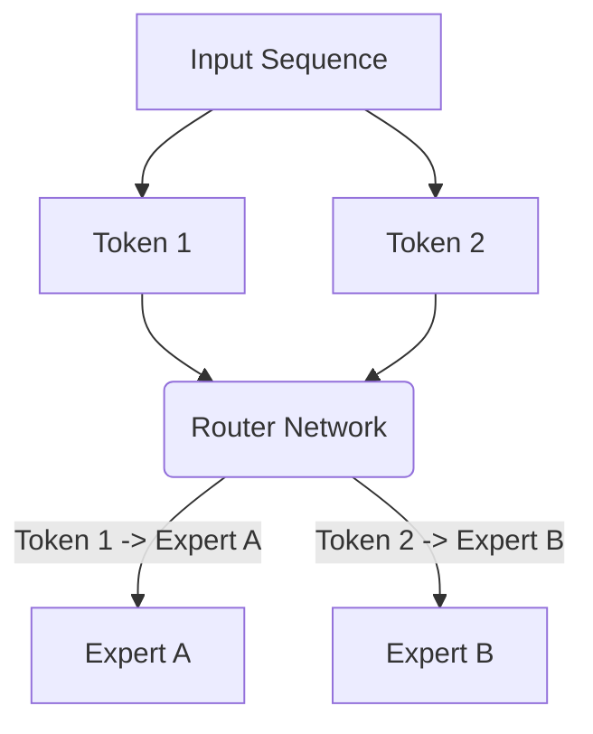

# Conditional Compute Sparsity (MoE)

## Overview
Conditional compute sparsity dynamically decides which parts of the neural network to activate based on the current input token, avoiding the cost of evaluating the entire network.

## Architecture & Flow
Below is a diagram representing the mechanics of **Conditional Compute Sparsity (MoE)**:

## Further Details
This component is vital to the implementation and optimization of modern sparse deep learning systems. It helps scale the parameter capacity of neural architectures while maintaining efficiency at training and inference time.

---
[← Back to README](../README.md)
