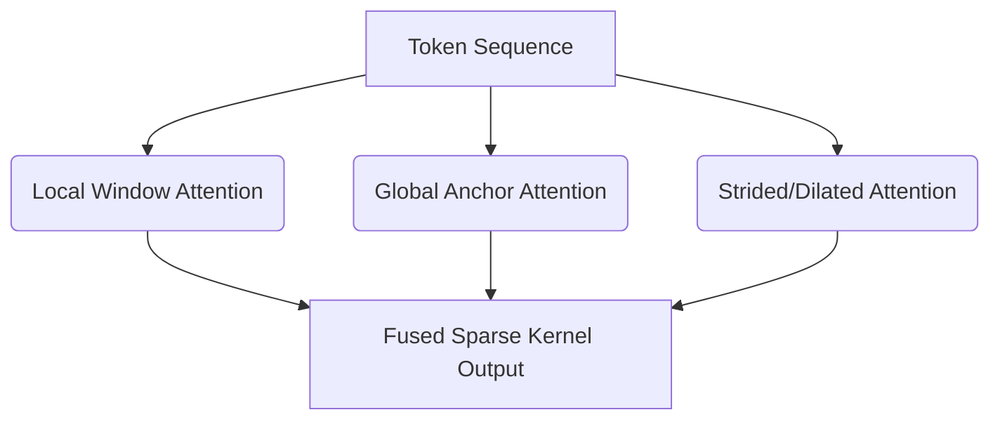

# Dense-Sparse Attention Kernels

## Overview
Dense-sparse attention kernels calculate attention only over specific geometric patterns (like local sliding windows or strided intervals) rather than full pairwise tokens, reducing attention complexity to linear or log-linear scale.

## Architecture & Flow
Below is a diagram representing the mechanics of **Dense-Sparse Attention Kernels**:

## Further Details
This component is vital to the implementation and optimization of modern sparse deep learning systems. It helps scale the parameter capacity of neural architectures while maintaining efficiency at training and inference time.

---
[← Back to README](../README.md)
