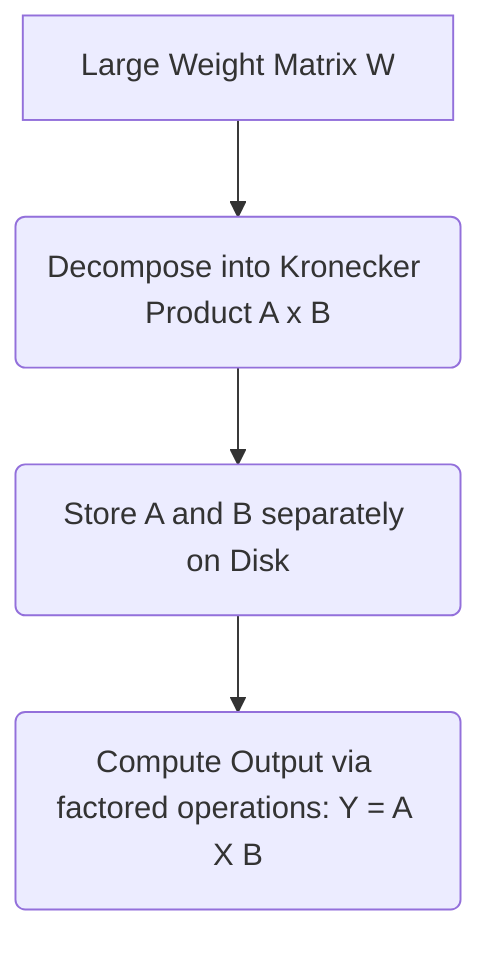

# Kronecker-Factored Tensor Blocks (Low-Rank Approximations)

## Overview
Kronecker-factored structures approximate high-dimensional matrices as the Kronecker product of smaller matrices, saving parameters and lowering computing/storage demands.

## Architecture & Flow
Below is a diagram representing the mechanics of **Kronecker-Factored Tensor Blocks (Low-Rank Approximations)**:

## Further Details
This component is vital to the implementation and optimization of modern sparse deep learning systems. It helps scale the parameter capacity of neural architectures while maintaining efficiency at training and inference time.

---
[← Back to README](../README.md)
