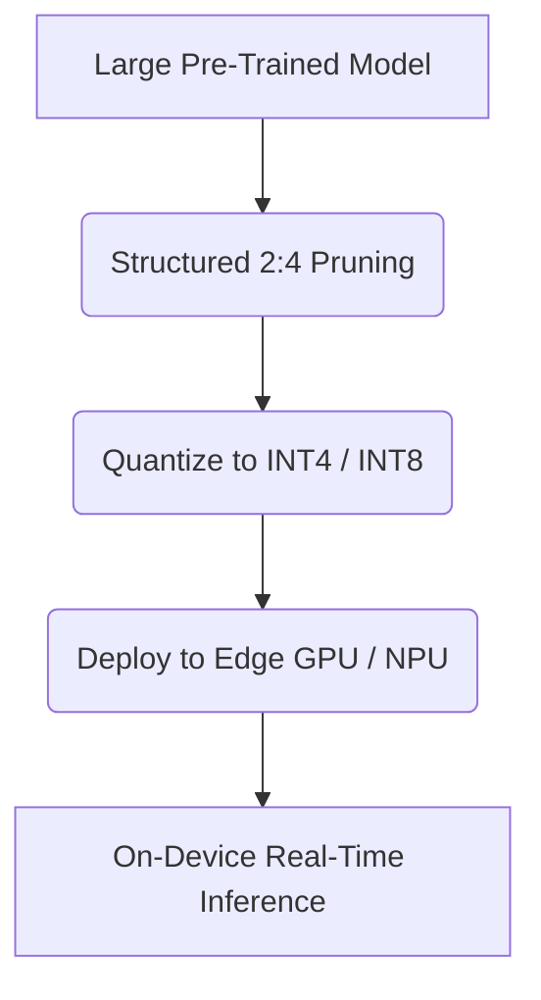

# Low-Latency Consumer-Device On-Edge Model Deployment

## Overview
Enables large language models to run directly on laptops, automobiles, and smartphones by combining structural pruning with 4-bit/8-bit quantization.

## Architecture & Flow
Below is a diagram representing the mechanics of **Low-Latency Consumer-Device On-Edge Model Deployment**:

## Further Details
This component is vital to the implementation and optimization of modern sparse deep learning systems. It helps scale the parameter capacity of neural architectures while maintaining efficiency at training and inference time.

---
[← Back to README](../README.md)
