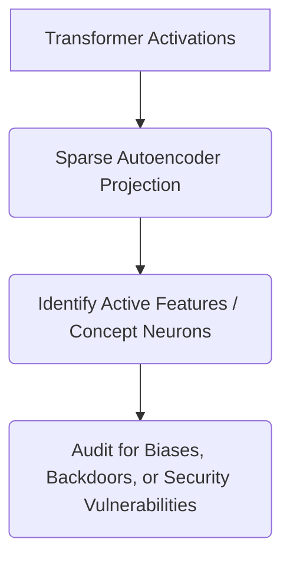

# Mechanistic Interpretability and Concept Auditing

## Overview
Using sparse autoencoders to dissect the latent activations of massive models, mapping continuous numerical distributions to discrete, inspectable, and auditable human concepts.

## Architecture & Flow
Below is a diagram representing the mechanics of **Mechanistic Interpretability and Concept Auditing**:

## Further Details
This component is vital to the implementation and optimization of modern sparse deep learning systems. It helps scale the parameter capacity of neural architectures while maintaining efficiency at training and inference time.

---
[← Back to README](../README.md)
