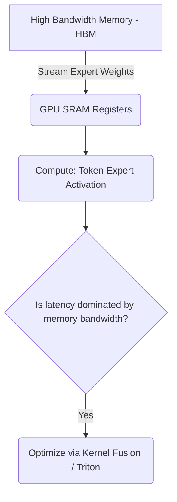

# Memory Bandwidth & Parameter Loading Latency Stagnation

## Overview
Sparse models face a challenge where low compute-to-memory ratios result in GPU Tensor Cores waiting on slow memory buses to stream large expert weight matrices into fast registers.

## Architecture & Flow
Below is a diagram representing the mechanics of **Memory Bandwidth & Parameter Loading Latency Stagnation**:

## Further Details
This component is vital to the implementation and optimization of modern sparse deep learning systems. It helps scale the parameter capacity of neural architectures while maintaining efficiency at training and inference time.

---
[← Back to README](../README.md)
