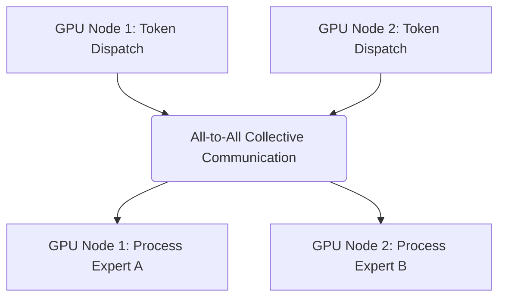

# Multi-Node Communication & All-to-All Latency Wall

## Overview
In distributed Mixture-of-Experts systems, sending tokens to experts across different physical nodes triggers extensive All-to-All communication, which can bottleneck high-speed computing clusters.

## Architecture & Flow
Below is a diagram representing the mechanics of **Multi-Node Communication & All-to-All Latency Wall**:

## Further Details
This component is vital to the implementation and optimization of modern sparse deep learning systems. It helps scale the parameter capacity of neural architectures while maintaining efficiency at training and inference time.

---
[← Back to README](../README.md)
