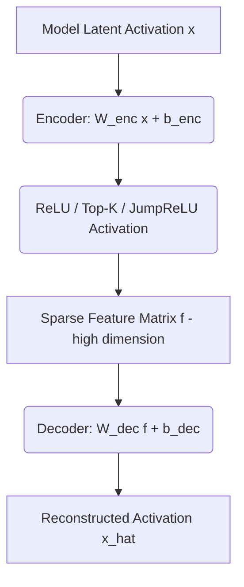

# Overcomplete Dictionary SAEs (Mechanistic Interpretability)

## Overview
Sparse Autoencoders (SAEs) project internal neural activations into a high-dimensional, overcomplete space with a sparsity penalty, mapping abstract concepts to distinct, human-interpretable features.

## Architecture & Flow
Below is a diagram representing the mechanics of **Overcomplete Dictionary SAEs (Mechanistic Interpretability)**:

## Further Details
This component is vital to the implementation and optimization of modern sparse deep learning systems. It helps scale the parameter capacity of neural architectures while maintaining efficiency at training and inference time.

---
[← Back to README](../README.md)
