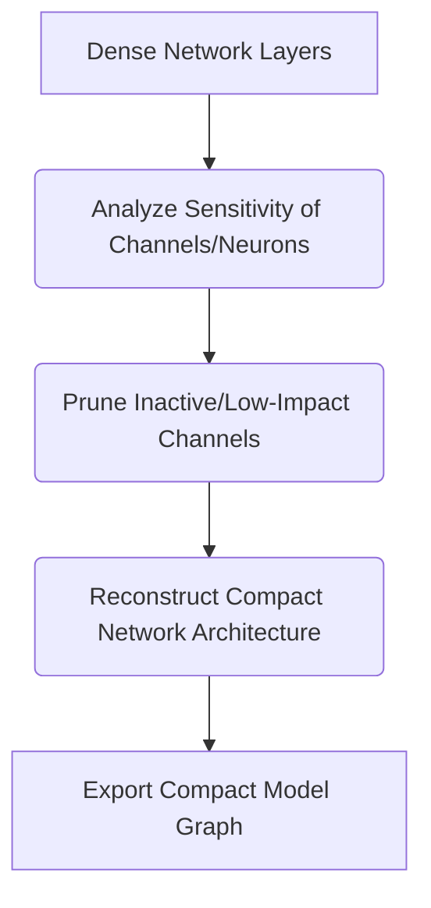

# Permanent Parameter Sparsity (Weight/Channel Pruning)

## Overview
Permanent parameter sparsity completely removes non-essential weights or channels from the network architecture, resulting in smaller storage size and lower memory usage during inference.

## Architecture & Flow
Below is a diagram representing the mechanics of **Permanent Parameter Sparsity (Weight/Channel Pruning)**:

## Further Details
This component is vital to the implementation and optimization of modern sparse deep learning systems. It helps scale the parameter capacity of neural architectures while maintaining efficiency at training and inference time.

---
[← Back to README](../README.md)
