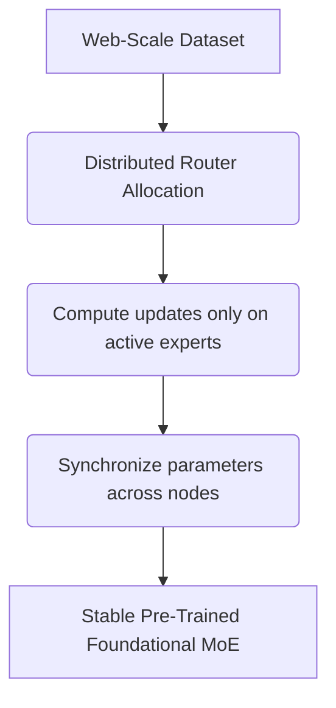

# Pre-Training Web-Scale Mixture-of-Experts Foundations

## Overview
Mixture-of-Experts scaling allows web-scale pre-training of models with hundreds of billions or trillions of parameters by ensuring each training token only activates a fraction of the total parameters.

## Architecture & Flow
Below is a diagram representing the mechanics of **Pre-Training Web-Scale Mixture-of-Experts Foundations**:

## Further Details
This component is vital to the implementation and optimization of modern sparse deep learning systems. It helps scale the parameter capacity of neural architectures while maintaining efficiency at training and inference time.

---
[← Back to README](../README.md)
