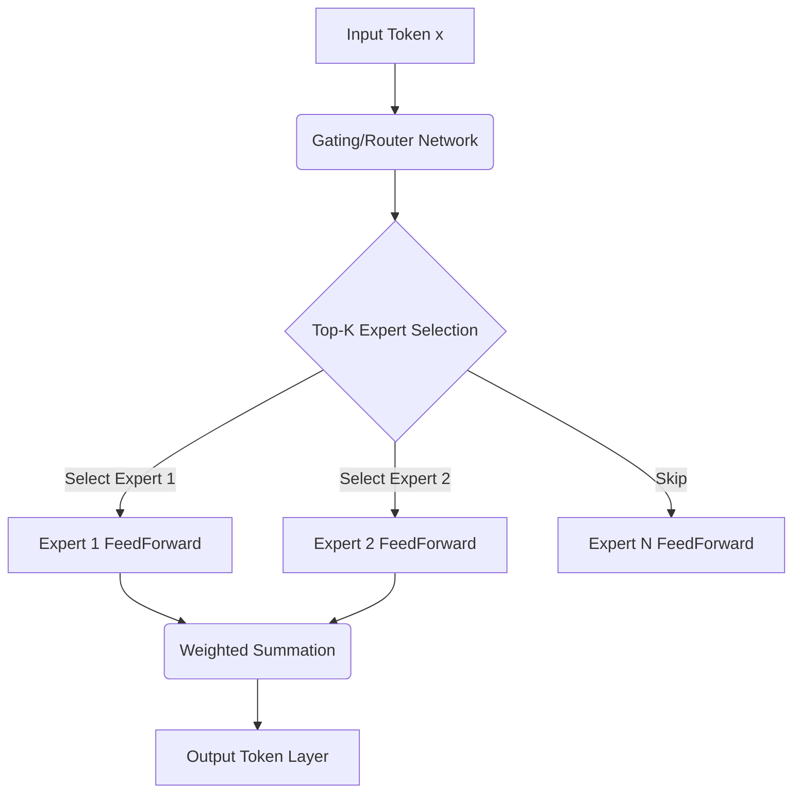

# Runtime Token-Routing (Mixture of Experts)

## Overview
Runtime token routing dynamically routes each incoming token to a subset of specialized experts (sub-networks) within the model, keeping the active parameter count per token constant while scaling total parameters.

## Architecture & Flow
Below is a diagram representing the mechanics of **Runtime Token-Routing (Mixture of Experts)**:

## Further Details
This component is vital to the implementation and optimization of modern sparse deep learning systems. It helps scale the parameter capacity of neural architectures while maintaining efficiency at training and inference time.

---
[← Back to README](../README.md)
