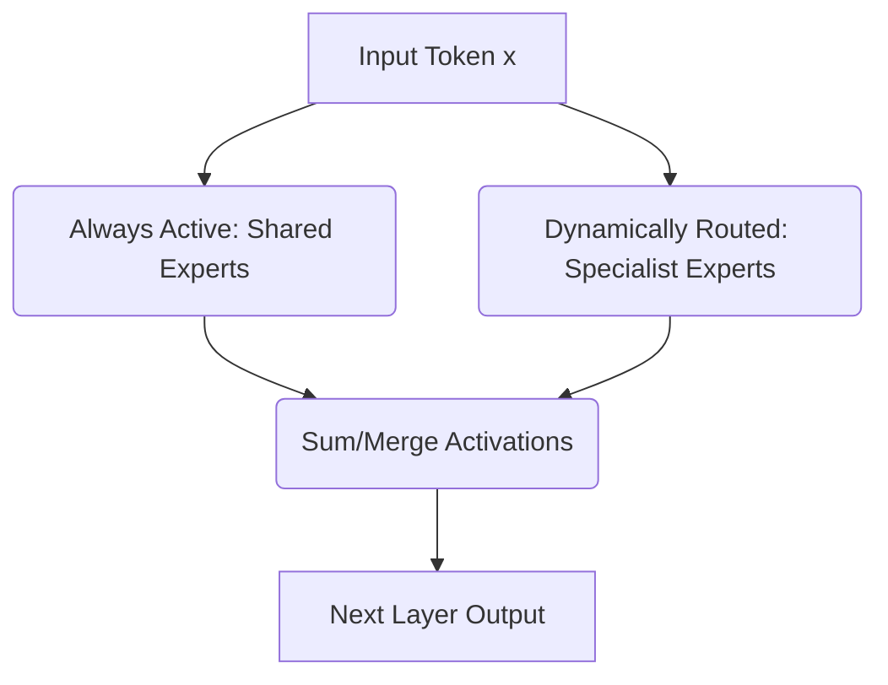

# Shared and Specialist Expert Topologies

## Overview
This architecture separates core general knowledge (routed to shared experts that are always active) from niche, contextual features (routed dynamically to specialized experts).

## Architecture & Flow
Below is a diagram representing the mechanics of **Shared and Specialist Expert Topologies**:

## Further Details
This component is vital to the implementation and optimization of modern sparse deep learning systems. It helps scale the parameter capacity of neural architectures while maintaining efficiency at training and inference time.

---
[← Back to README](../README.md)
