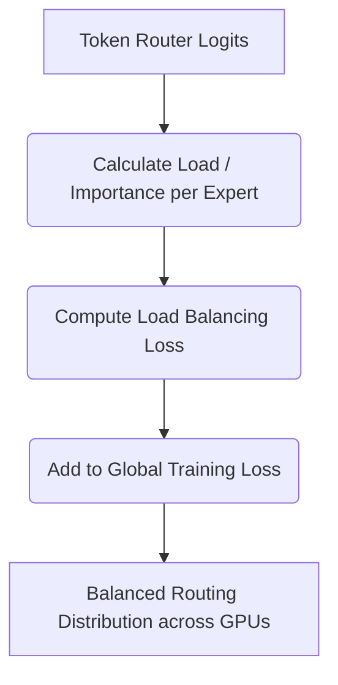

# Sparse Auxiliary Token Routers (Aux-Loss Gates)

## Overview
Auxiliary losses are introduced to prevent token routing collapse, where a few experts receive all the tokens while others remain idle, ensuring balanced hardware resource usage across nodes.

## Architecture & Flow
Below is a diagram representing the mechanics of **Sparse Auxiliary Token Routers (Aux-Loss Gates)**:

## Further Details
This component is vital to the implementation and optimization of modern sparse deep learning systems. It helps scale the parameter capacity of neural architectures while maintaining efficiency at training and inference time.

---
[← Back to README](../README.md)
