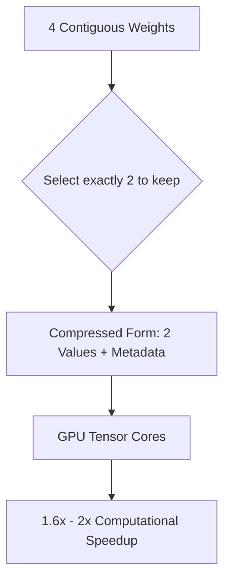

# Structured Sparsity & Hardware Co-Design

## Overview
Structured sparsity enforces regular patterns of zeros (e.g., 2:4 semi-structured sparsity) that match the execution patterns of Tensor Cores in modern GPUs, enabling direct hardware-level acceleration.

## Architecture & Flow
Below is a diagram representing the mechanics of **Structured Sparsity & Hardware Co-Design**:

## Further Details
This component is vital to the implementation and optimization of modern sparse deep learning systems. It helps scale the parameter capacity of neural architectures while maintaining efficiency at training and inference time.

---
[← Back to README](../README.md)
